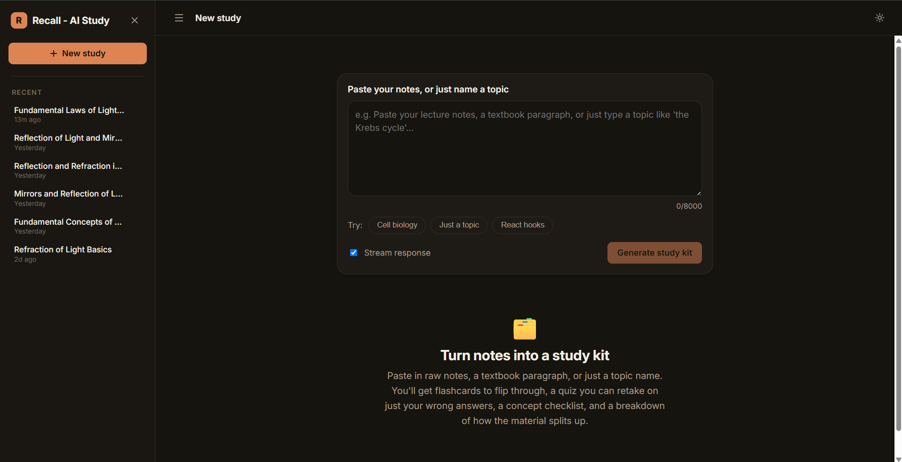
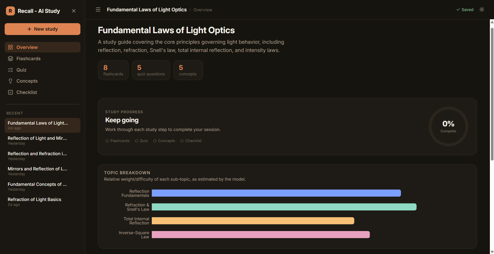
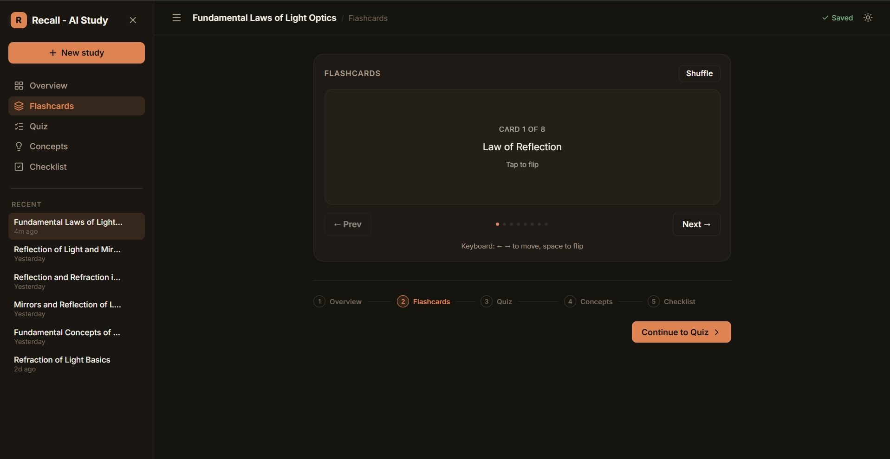
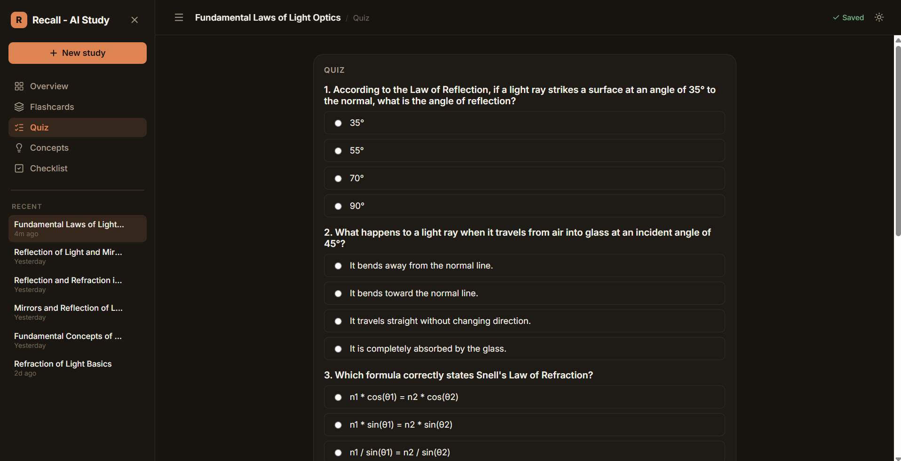
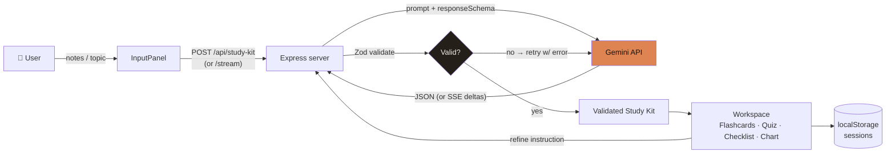

# Recall — AI Study Assistant

Paste in notes (or just a topic), get back an interactive study kit: flashcards, a retakeable quiz, a concept checklist, and a confidence chart — real stateful UI, not a chat transcript.

Built for a Frontend Internship take-home (Study Assistant option).

**Live demo:** https://recall-ai-study-assistant-client.vercel.app

**Demo video:**  https://drive.google.com/file/d/1FekLl1vlwArU-j1f3fKs5t6-4TB9KK1c/view?usp=sharing

## Screenshots

### Landing


### Dashboard


### Flashcard


### Quiz


---

## Tech Stack

| Layer | Tech |
|---|---|
| Frontend | React 18 + Vite, `lucide-react`, `recharts` |
| Backend | Node.js + Express (thin proxy only) |
| AI | Google Gemini (`@google/genai`), structured JSON output |
| Validation | Zod (server-side, before anything reaches the client) |
| Persistence | `localStorage` (sessions, theme) — no DB |
| Testing | Vitest (streaming JSON parser unit tests) |

---

## Features

- 🔁 **Flashcards** — flip, shuffle, full keyboard control (`← →` move, `space` flip)
- ✅ **Quiz** — multiple choice, retest just the ones you got wrong
- 📋 **Concept checklist** — track what you've reviewed
- 📊 **Confidence chart** — sub-topic breakdown of the material
- ⚡ **Streaming generation** — flashcards appear live as the model drafts them
- ✍️ **Refinement loop** — "add 3 more flashcards", "make the quiz harder", etc. edits the kit in place
- 💾 **Sessions** — autosaved to `localStorage`, browse/reload/delete from the sidebar
- 🌓 **Dark/light theme**, mobile-first responsive layout

## How It Works



**Flow, in words:**

1. User submits notes/topic → client hits the Express proxy (never Gemini directly)
2. Server prompts Gemini with a strict `responseSchema`
3. Response is Zod-validated — invalid output triggers a retry with the specific error fed back into the next prompt
4. Validated kit streams/returns to the client and renders as flashcards, quiz, checklist & chart
5. Every generation/refinement autosaves to `localStorage`; refinements loop back through the same validate → retry pipeline

## Why a backend, for a "frontend" task?

The Gemini API key can't be shipped to the browser (network tab = instantly stolen). The Express server is the minimum viable proxy: routing, Zod validation, retry-with-repair on bad model output. All product logic (UI, state, interactivity) lives in the client.

## Quick Start

```bash
git clone <repo-url>
cd study-assistant
npm install
```

1. Get a free key: https://aistudio.google.com/apikey
2. Add it:
   ```bash
   cp server/.env.example server/.env
   # edit server/.env → GEMINI_API_KEY=...
   ```
3. Run both client + server:
   ```bash
   npm start
   ```
4. Open **http://localhost:5173**

| Command | What it does |
|---|---|
| `npm start` | client (`:5173`) + server (`:8787`) together |
| `npm run dev:client` | client only |
| `npm run dev:server` | server only |
| `npm run test -w client` | run unit tests |

## Project Structure

```
study-assistant/
├── server/            Express proxy — only place holding the API key
│   ├── index.js        /api/study-kit, /study-kit/stream, /study-kit/refine
│   └── lib/             schema.js (Gemini schema + zod + prompts), gemini.js (calls/retry/streaming)
└── client/             Vite + React
    └── src/
        ├── api/          fetch + hand-rolled SSE parsing
        ├── hooks/        useStudyKitGenerator — app state machine
        ├── components/   deck, quiz, checklist, chart, refinement bar...
        └── lib/          partial-JSON streaming parser, localStorage sessions
```

## Handling Bad AI Output (main engineering focus)

1. **Constrained sampling** — Gemini `responseSchema` biases output toward the right shape (not a guarantee)
2. **Real validation** — every response passes a Zod schema before reaching the client
3. **Retry-with-repair** — invalid output → up to 3 retries, feeding the *specific* validation error back into the prompt
4. **Streaming fallback** — truncated stream → transparent non-streaming retry
5. **Honest error mapping** — missing key / timeout / rate-limit / still-invalid all map to specific user-facing messages
6. **No stale-response clobbering** — `AbortController` + request-id guard on every new generation
7. **Server never hangs** — every Gemini call is timeout-wrapped

## AI Usage Note

Built with heavy use of Claude — scaffolding, majority of component/server code, and the failure-handling design above. I reviewed, ran, and debugged everything myself (including a real Node.js gotcha: `req.on("close")` fires on body-read not disconnect — the SSE route needed `res.on("close")` instead). Happy to walk through or modify any part of this code live.

## Known Limitations

- No auth; rate limiting is basic in-memory per-IP (resets on restart, not multi-instance safe)
- Refinement keeps item `id`s stable via prompt instruction only — not code-enforced
- Only the streaming JSON parser has unit tests; no server/component test coverage
- Flashcard/quiz/concept counts are model-chosen within schema ranges, not user-configurable
- Gemini model pinned via `GEMINI_MODEL` env var (default `gemini-2.5-flash`)

## Time Spent

~8 hours total

| Task | Time |
|---|---|
| Schema/prompt design + failure handling (server) | 3h |
| Component/state architecture (client) | 2.5h |
| Streaming + partial-JSON parsing | 1h |
| Styling / responsive / polish | 1h |
| Testing + README | 0.5h |
