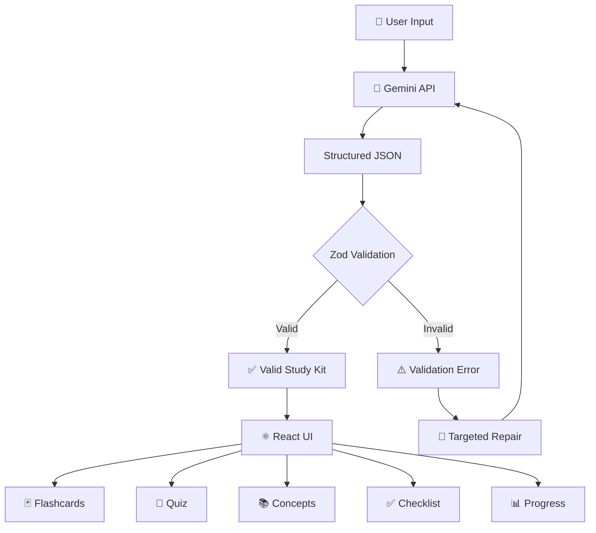
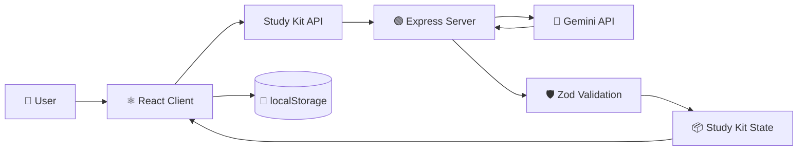

# 🧠 Recall

### AI-Powered Active Learning & Study Assistant

> Turn any topic or your own notes into an interactive study experience with
> AI-generated flashcards, quizzes, concepts, checklists, and progress tracking.

<p align="center">
  <a href="YOUR_DEPLOYED_APP_LINK">
    
  </a>
  <a href="YOUR_VIDEO_LINK">
    
  </a>
</p>

<p align="center">
  
  
  
  
  
</p>

---

## 🎯 The Idea

Most AI study tools stop after generating content.

**Recall turns that content into a complete learning workflow.**

```text
                ┌─────────────────────┐
                │     YOUR INPUT      │
                │                     │
                │  Notes / Topic /    │
                │  Study Material     │
                └──────────┬──────────┘
                           │
                           ▼
                ┌─────────────────────┐
                │      GEMINI AI      │
                │                     │
                │ Structured Study    │
                │ Kit Generation      │
                └──────────┬──────────┘
                           │
                           ▼
                ┌─────────────────────┐
                │       RECALL        │
                │                     │
                │ Validate → Organize │
                │ → Personalize       │
                └──────────┬──────────┘
                           │
          ┌────────────────┼────────────────┐
          ▼                ▼                ▼
     🃏 Flashcards     📝 Quiz         📚 Concepts
          │                │                │
          └────────────────┼────────────────┘
                           ▼
                   ┌───────────────┐
                   │  ✅ Checklist │
                   │  📊 Progress  │
                   │  🔁 Review    │
                   └───────────────┘
```

### Generate → Learn → Test → Review → Complete

---

# ✨ Product Highlights

| 🧠 AI Study Kit | 🃏 Active Recall | 📝 Assessment |
|---|---|---|
| Topic-based generation | Interactive flashcards | MCQ quizzes |
| Notes → study material | Flip & navigate | Instant feedback |
| Structured output | Know / Review flow | Explanations |
| AI refinement | Keyboard controls | Retry wrong answers |

| 📊 Progress | 💾 Persistence | 🎨 Experience |
|---|---|---|
| Visual progress tracking | Saved sessions | Responsive UI |
| Completion states | Reopen previous sessions | Dark / Light mode |
| Guided next steps | Browser persistence | Accessibility |

---

# 📸 Product Preview

> Replace these images with your actual screenshots.

<table>
<tr>
<td width="50%">

<p align="center"><b>Overview Dashboard</b></p>
</td>
<td width="50%">

<p align="center"><b>Active Recall Flashcards</b></p>
</td>
</tr>

<tr>
<td width="50%">

<p align="center"><b>Interactive Quiz</b></p>
</td>
<td width="50%">

<p align="center"><b>Study Progress</b></p>
</td>
</tr>
</table>

---

# 🚀 Core Experience

### 01 · Generate

Enter a topic or paste your study material.

Recall sends the input to Gemini and generates a structured study kit.

### 02 · Learn

Review concepts and move through interactive flashcards designed for active recall.

### 03 · Test

Take a generated quiz with:

- Answer states
- Instant feedback
- Explanations
- Score tracking
- Wrong-answer retry

### 04 · Track

Use the checklist and progress system to see how much of the study session has been completed.

### 05 · Refine

Don't like the generated material?

Use AI refinement to improve or modify the existing study kit without starting over.

---

# 🧠 AI Engineering

Recall treats AI output as **untrusted input** rather than assuming that
the model will always return perfect data.

Gemini generates a structured study kit which is validated on the server
before the data reaches the UI.

## AI Reliability Pipeline



### Reliability features

- Structured JSON generation
- Server-side schema validation
- Targeted repair/retry
- Streaming support
- Timeout handling
- Rate-limit handling
- Malformed-response handling
- Stale-request protection
- User-friendly error states

---

# ⚡ Streaming

Study-kit generation supports **Server-Sent Events (SSE)** for progressive
generation.

The client can display partial results while the server maintains the
fully validated response as the source of truth.

```text
Gemini
   │
   │ SSE stream
   ▼
Partial JSON
   │
   ▼
Live Preview
   │
   ▼
Complete Response
   │
   ▼
Server Validation
   │
   ▼
Final Study Kit
```

This allows the interface to feel responsive even when AI generation
takes longer to complete.

---

# 🔄 AI Refinement

Recall supports iterative learning instead of forcing users to regenerate
everything from scratch.

```text
Existing Study Kit
        │
        ▼
"Make the quiz harder"
        │
        ▼
    Gemini AI
        │
        ▼
Updated Structured Study Kit
        │
        ▼
      Recall
```

Examples:

- Make the quiz harder
- Add more flashcards
- Simplify the concepts
- Focus on a specific topic
- Improve explanations

---

# 💾 Saved Sessions

Study sessions are persisted locally so users can:

- Reopen previous sessions
- Continue studying
- Keep progress
- Delete old sessions
- Switch between recent sessions

Session persistence currently uses browser `localStorage`.

---

# 🏗 Architecture



### Frontend

```text
client/
├── components/
│   ├── Flashcards
│   ├── Quiz
│   ├── Checklist
│   ├── Progress
│   ├── Concepts
│   └── Navigation
│
├── hooks/
├── api/
└── lib/
```

### Backend

```text
server/
├── index.js
└── lib/
    ├── gemini.js
    └── schema.js
```

---

# 🛠 Tech Stack

| Layer | Technology | Purpose |
|---|---|---|
| Frontend | React 18 | Component-based UI |
| Build Tool | Vite | Fast development/build |
| Styling | CSS | Responsive visual system |
| Backend | Node.js + Express | API layer |
| AI | Gemini API | Study-kit generation & refinement |
| Validation | Zod | Structured response validation |
| Streaming | SSE | Progressive AI generation |
| Persistence | localStorage | Saved sessions & progress |
| Testing | Vitest | Client-side testing |

---

# 💡 Engineering Highlights

| Challenge | Approach |
|---|---|
| AI can return malformed data | Schema validation + repair |
| Long AI responses | SSE streaming |
| Invalid generated structures | Targeted retry |
| API failures | Explicit error states |
| Timeouts | Request timeout handling |
| Stale requests | Abort/request protection |
| Session persistence | localStorage |
| API key security | Server-side Gemini integration |
| Responsive experience | Mobile → desktop layouts |
| Study progression | Persistent progress state |

---

# 🔐 Security

The Gemini API key is **never exposed to the browser**.

```text
Browser
   │
   │ User request
   ▼
Express Server
   │
   │ GEMINI_API_KEY
   ▼
Gemini API
```

The API key is stored in the server environment and is excluded from
version control through `.gitignore`.

> Never commit `server/.env` or any real API key to GitHub.

---

# 📱 UX & Accessibility

Recall was designed as a study workflow rather than a collection of
independent screens.

### UX

- Clear study progression
- Dedicated workspaces
- Strong visual hierarchy
- Consistent interactions
- Responsive layouts
- Dark / light mode
- Loading and error states
- Completion feedback
- Saved-session navigation

### Accessibility

- Keyboard navigation
- Visible focus states
- Semantic controls
- Accessible labels
- Reduced-motion consideration
- Contrast-aware UI

---

# 🧪 Testing

Run the client tests with:

```bash
npm run test -w client
```

The project includes tests around the streaming partial-JSON parser and
client-side data handling.

---

# 🚀 Run Locally

## Requirements

- Node.js
- Gemini API key

## 1. Clone

```bash
git clone https://github.com/Chiiraag11/Recall---AI-Study-Assistant.git
cd Recall---AI-Study-Assistant
```

## 2. Install dependencies

```bash
npm install
```

## 3. Configure Gemini

Create:

```text
server/.env
```

Add:

```env
GEMINI_API_KEY=your_gemini_api_key
```

## 4. Start the application

```bash
npm run dev
```

The development environment starts:

```text
Frontend → http://localhost:5173
Backend  → http://localhost:8787
```

---

# 📂 Project Structure

```text
recall-ai-study-assistant/
│
├── client/
│   ├── src/
│   │   ├── components/
│   │   ├── hooks/
│   │   ├── api/
│   │   └── lib/
│   ├── index.html
│   └── package.json
│
├── server/
│   ├── lib/
│   │   ├── gemini.js
│   │   └── schema.js
│   ├── index.js
│   ├── .env.example
│   └── package.json
│
├── screenshots/
├── README.md
├── package.json
└── package-lock.json
```

---

# 🤖 AI-Assisted Development

AI tools were used during development for:

- Scaffolding and implementation assistance
- Debugging
- UI iteration
- Error handling improvements
- Development support

The application was independently run, tested, reviewed, and iterated
throughout development.

---

# ⚠️ Known Limitations

- No authentication — intended for a single-user/demo environment
- Session persistence currently uses browser `localStorage`
- Server-side test coverage is limited
- Gemini free-tier quotas can restrict API requests during testing

---

# 🗺️ Future Improvements

Potential next steps:

- User authentication
- Cloud-based session synchronization
- Spaced-repetition scheduling
- More detailed analytics
- Persistent database storage
- Additional AI providers
- Collaborative study sessions

---

# 👨‍💻 Developer

### Chirag Prasad

Frontend / Full-Stack Developer

[GitHub](https://github.com/Chiiraag11)

---

## ⭐ Project Summary

**Recall is not just an AI text generator.**

It combines:

```text
AI Generation
      +
Structured Validation
      +
Interactive Learning
      +
Progress Tracking
      +
Persistent Sessions
      +
Responsive UX
```

into one complete study workflow.

> **Generate → Learn → Test → Review → Complete**